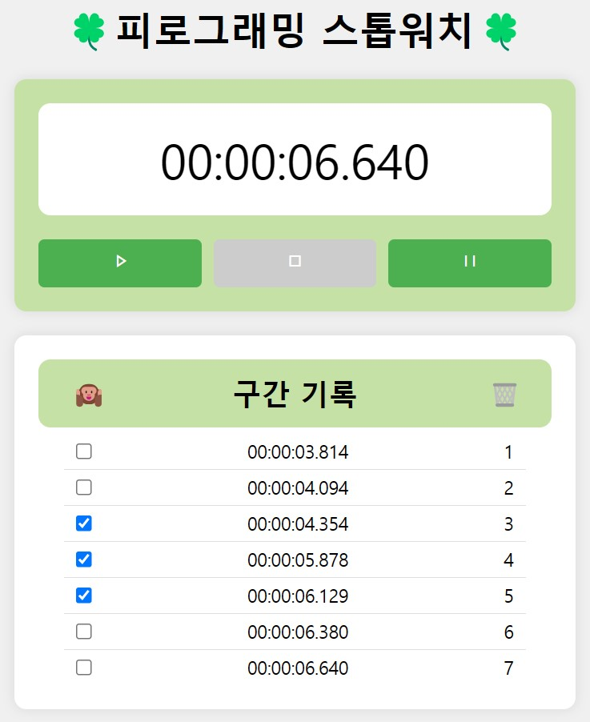

# 🍀피로그래밍 스톱워치🍀
 

### (0) 디자인적 요소 추가

### (1) 스톱워치 기능
a. 초(second): 밀리초(millisecond)  
b. 시작(start), 정지(그만), 재설정(reset) 버튼 및 기능 구현

### (2) 기록 추가
a. 정지(그만) 버튼 눌렀을 때 추가되도록

### (3) 기록 선택 삭제

### (4) 기록 전체 삭제